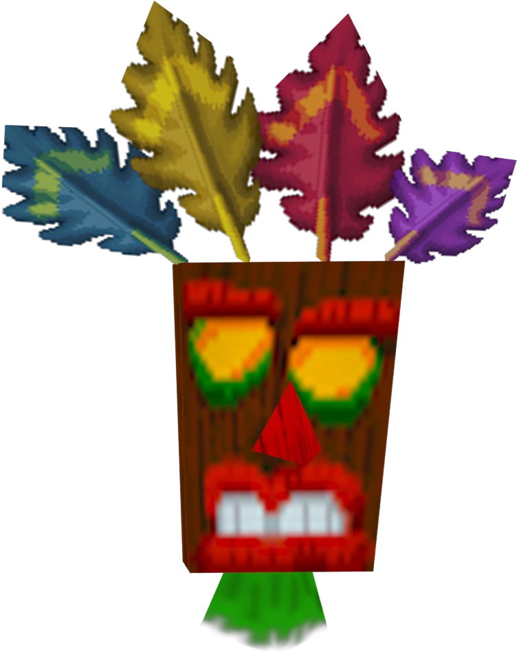

<p align="center">
  
</p>

# aku aku

ai agent taste, version-controlled.

instructions, skills, configs, workflows, and the occasional strong opinion. part backup, part public goods.

named after **Aku Aku**, the protective mask power-up from *Crash Bandicoot*.

fork what hits. remix to taste. leave the rest.

## plug it in

clone the repo, `cd` into it, then make [`AGENTS.md`](./AGENTS.md) the source of truth:

```sh
mkdir -p "$HOME/.claude" "$HOME/.codex"
ln -sfn "$PWD/AGENTS.md" "$HOME/.claude/CLAUDE.md"
ln -sfn "$PWD/AGENTS.md" "$HOME/.codex/AGENTS.md"
```

one file, same taste everywhere. the `-f` replaces anything already living at those two paths, so back it up first if needed.

claude code reads `~/.claude/CLAUDE.md`; [codex](https://learn.chatgpt.com/docs/agent-configuration/agents-md) reads `~/.codex/AGENTS.md`. both resolve to the file tracked here.

git can preserve symlinks inside a repo, but it cannot install them elsewhere in your home directory. these few commands are the tiny installer.

## License

Original material in this repository is available under the [MIT License](./LICENSE). The Aku Aku character and artwork belong to their respective rights holders and are not covered by that license. [Image source](https://crash-bandicoot.fandom.com/fr/wiki/Aku_Aku).
